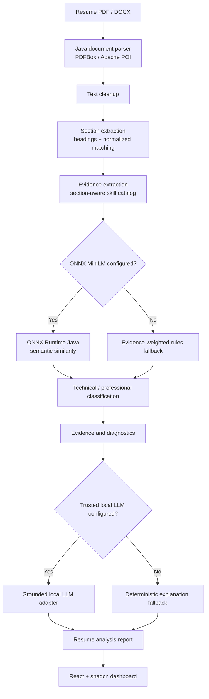

# ResumeLens

**Lightweight AI-powered Resume Intelligence**

ResumeLens is a Java-first resume analysis application for extracting and explaining the technical and professional signals actually present in PDF and DOCX resumes. It is designed as an internship-ready engineering project: local-first, explainable, resource-conscious, and runnable without a cloud LLM.

## Problem statement

Recruiters and candidates often need a quick, traceable view of what a resume communicates. A generic large-language-model summary is not enough: it may infer facts, hide its reasoning, and require unnecessary cloud resources. ResumeLens instead preserves the evidence behind every detected signal and clearly distinguishes optional model behavior from deterministic fallbacks.

## Architecture



## Technology stack

- Frontend: React 19, TypeScript, Vite, Tailwind CSS, the supplied shadcn preset (`b27GcrRo`), Base UI primitives, Lucide, Recharts.
- Backend: Java 21, Spring Boot, Spring Web, Bean Validation, Actuator, Maven.
- Parsing: Apache PDFBox 3 and Apache POI XWPF.
- Optional local ML: ONNX Runtime Java with a MiniLM-compatible `model.onnx` and `vocab.txt`.
- Optional local LLM: a trusted local process adapter, such as a Qwen3-0.6B Q4 runner.

## Technical vs professional classification

The default classifier is real, deterministic analysis—not demo data:

1. Extract text from the uploaded PDF/DOCX in Java.
2. Detect sections using normalized heading matching.
3. Match a carefully scoped technical and professional-skill catalog within complete resume sentences.
4. Retain each matching sentence, source section, category, and contextual relevance.
5. Calculate the two classification scores as each category’s share of total observed evidence relevance. They are explicitly not candidate-quality scores or probability claims.

When configured, ONNX MiniLM sentence embeddings are pooled in-process and compared against technical and professional category anchors. Those similarities are used to enhance evidence relevance; the rule path remains available if model initialization or inference fails.

## RAM constraint and diagnostics

The default application path runs without a bundled embedding model or LLM. It therefore avoids a large model download and can operate on modest machines. Optional MiniLM is CPU-only and a small quantized LLM is deliberately optional.

ResumeLens does not claim a universal RAM number. It reports measured document time, classifier time, analysis duration, current JVM heap, maximum configured JVM heap, and a sampled JVM heap high-water mark in the dashboard/API. Native ONNX and local-LLM process allocations are not exposed portably by the JVM, so validate the complete process footprint on the target machine before making a deployment claim.

## Privacy and safety

- PDF/DOCX extension and size validation is enforced server-side.
- File signatures are checked (`%PDF` for PDFs and ZIP/OOXML headers for DOCX) before parsing.
- A local fixed-window upload limit defaults to 20 analysis requests per minute per direct client address.
- Documents are parsed from request bytes and are not persisted by the default in-memory session history.
- Uploads are never executed and clients cannot provide filesystem paths.
- Core analysis does not call external APIs.
- The LLM adapter receives only extracted evidence and asks for an evidence-only explanation; deterministic text remains the fallback.

## Installation

Prerequisites: Java 21+, Maven 3.9+, Node 20+.

```bash
cd backend
mvn test
mvn spring-boot:run
```

In a second terminal:

```bash
cd frontend
npm install
npm run dev
```

Open `http://localhost:5173`. Vite proxies `/api` to the default Spring Boot port (`8080`).

> In restricted environments, Maven may require a writable local repository, for example: `mvn -Dmaven.repo.local=/private/tmp/resumelens-m2 test`.

## Model setup

Copy `.env.example` values into your shell or deployment configuration. To enable MiniLM, provide both paths:

```bash
export RESUMELENS_ONNX_MODEL_PATH=/absolute/path/model.onnx
export RESUMELENS_ONNX_VOCAB_PATH=/absolute/path/vocab.txt
```

The model must expose BERT-style `input_ids` and `attention_mask` inputs with a token-embedding output, as is typical for MiniLM export. The application reports a fallback status instead of pretending the model is loaded if either asset is missing or incompatible.

To enable a local LLM, set `RESUMELENS_LLM_ENABLED=true` and point `RESUMELENS_LLM_COMMAND` at an executable trusted local adapter. The adapter reads the grounded prompt on standard input and returns concise text on standard output. It is intentionally not enabled by default.

## REST API

| Method | Endpoint | Purpose |
| --- | --- | --- |
| `POST` | `/api/resumes/analyze` | Upload multipart field `file` (PDF/DOCX) and create analysis |
| `GET` | `/api/analyses/{id}` | Read complete result |
| `GET` | `/api/analyses/{id}/skills` | Read categorized detected skills |
| `GET` | `/api/analyses/{id}/evidence` | Read traceable evidence |
| `GET` | `/api/analyses/{id}/report` | Read full report |
| `GET` | `/api/analyses` | Read in-memory session history |
| `DELETE` | `/api/analyses/{id}` | Remove a session report |
| `GET` | `/api/system/diagnostics` | Read live runtime diagnostics |
| `GET` | `/api/health` | Application health response |

## Testing

```bash
cd backend && mvn test
cd frontend && npm run build
```

Backend tests cover PDF extraction, DOCX extraction, heading-based section detection, technical/professional classification, evidence retention, and the no-evidence result. The frontend is TypeScript-checked and production-built. Synthetic test resume content is in [`sample-resumes`](sample-resumes).

## Sample resumes

Five synthetic source resumes are provided for safe test-data creation:

- Software engineer
- Data scientist
- Professional-skills-heavy coordinator
- Mixed product-engineering profile
- Minimal profile

They are plain text source material rather than pretend upload fixtures; create an actual PDF/DOCX from them to test document parsing.

## Limitations and future improvements

- History is intentionally session-only to avoid retaining resumes by default. Add encrypted persistence with an explicit retention policy if needed.
- Scanned/image-only PDFs need OCR, which is not included because it materially changes the resource profile.
- The optional LLM adapter has a deliberately narrow interface. A production deployment should add structured JSON validation and an allowlisted local runner integration.
- Add browser-level upload/dashboard tests, authenticated multi-user storage, rate limiting backed by a distributed store, and target-machine memory benchmarks for production rollout.
